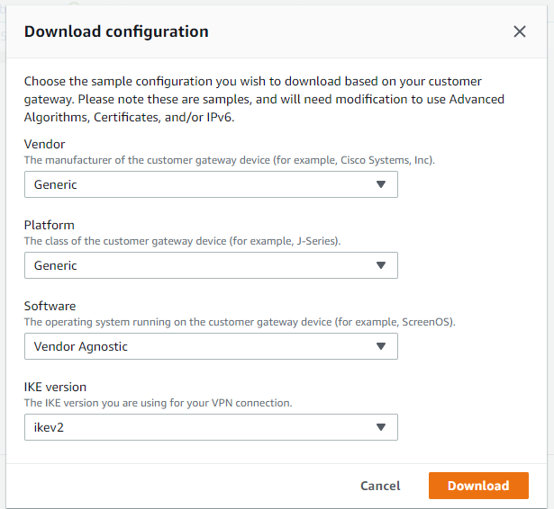
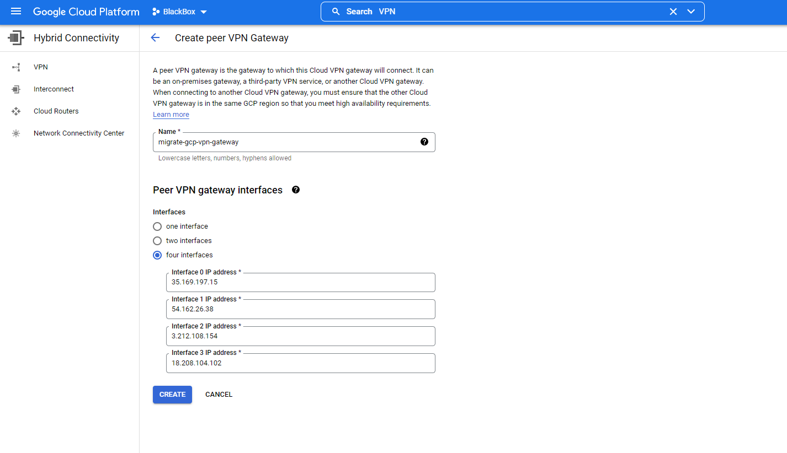
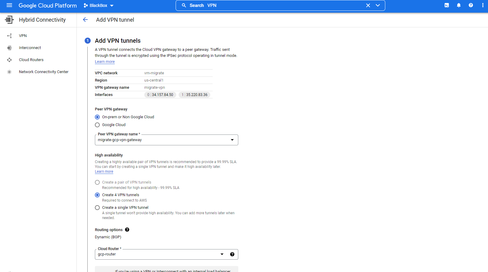
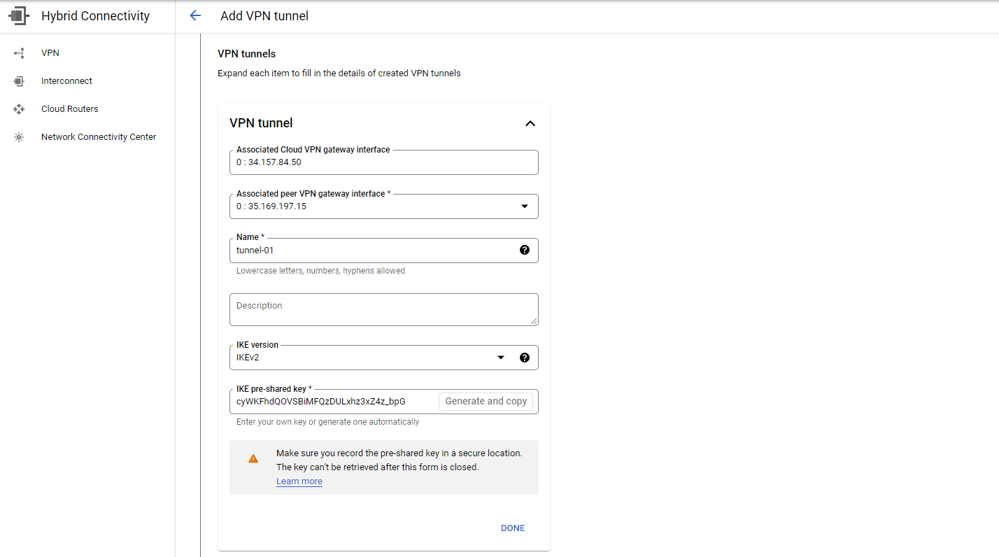
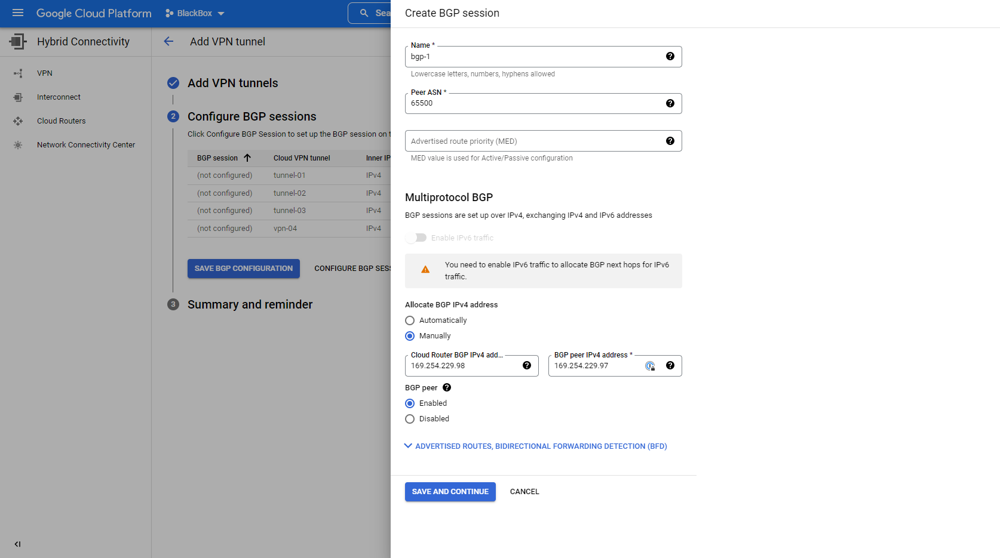
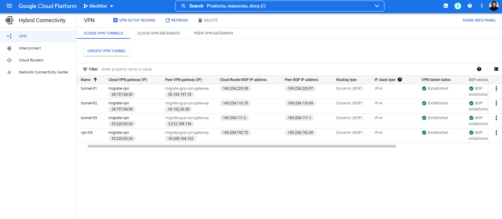

# Creating an GCP-AWS VPN tunnel

Virtual Private Network (VPN) can facilitate private connection and thus, transfer of data between two different VPCs in different cloud environments. To configure a VPN between AWS and GCP, the [official documentation](https://cloud.google.com/architecture/build-ha-vpn-connections-google-cloud-aws) from Google was used. The cloud environments used were sandbox accounts of Nordcloud Oy in AWS and GCP. 

### Steps: 

1. VPC in GCP 
2. HA VPN gateway and Cloud Router in GCP
3. Customer Gateways on AWS
4. VPN connection with dynamic routing in AWS
5. External VPN gateway and VPN tunnels on Google Cloud 

The steps are gone through sequentially in the document and screenshots and explanations are provided when deemed necessary and possible. 

 VPN architecture diagram as shown in Google documentation.

---

First step is to ***create a VPC*** in Google Cloud with a custom subnet.

Create a VPC in Google following the wizard, use the custom subnet. Use desired names and IP ranges. 

 

When the creation is done. It is time to create HA VPN Gateway. 
In the creation wizard, enter the name and select the VPC you just created. Fill the required fields and continue. 

 

Open the Cloud Routers section in different tab and click on “Create Router”
In the creation wizard, give the router a name and choose your VPC and Region. Fill other details as shown and click create. 

Be sure to select “Advertise all subnets visible to the cloud router”

Now time to head over to the AWS console. Login and switch to your desired role. 
Then, click on Services > VPCs > Customer Gateways > Create Customer Gateways

Follow the creation wizard. This step has to be done twice. 

Make sure to put the IP address of Interface: 0 and Interface: 1 from the details on the HA VPN you created in the GCP in the field “IP Address” in Customer Gateway creation wizard. 

 

 

After creating the Customer Gateway for each Interface of GCP HA VPN, now it is time to create Target Gateway and attach it to your VPC network. 

There can be Virtual Private Gateways or Transit Gateways. We are creating Virtual Private Gateways. So from the console, click on Services > VPCs > Virtual Private Gateways > Create Virtual Private Gateway. Give it a name and put ASN different from your ASN in GCP gateway. 

 

After the creation is complete, select your newly created Virtual Private Gateways and Click on Actions > Attach to VPC. 

From the following wizard, select your created VPC in AWS then click “Attach to VPC”
You will see that the Virtual Private Gateway is now attached. 

 

---
 

Next requirement is ***setting up a site to site VPN connection with dynamic routing.***
To do that, from the console Click on Services > VPC > Site to site VPN connections > Create a VPN Connection.

In the creation wizard, give it a name tag, click on Virtual Private Gateway, then on the dropdown menus, select the Virtual Private Gateway you just created and Click Existing Customer Gateway and select the newly created Customer Gateway ID (There are two, click first and second one will be used for vpn-02) . Check the Dynamic routing. You can leave the rest as they are. 

 

Repeat the process for the second connection. 

Time to Download the VPN configuration files for both connections. From the list, select one connection and click on “Download Configuration”

In the resulting screen, choose “Generic” for the Vendor and “ikev2” for IKE version. 

 

Check if the files are downloaded.

Now, to ***create external VPN gateways and VPN tunnels in GCP***, go to GCP console. 
From the burger menu, select Hybrid Connectivity under Networking, then select “Peer VPN Gateways” from the options and click “Create Peer VPN Gateway”

In the wizard, give the connection gateway a name. Then choose “four interfaces” from the options. 

For IP addresses for the interface, use each of the downloaded configuration files to find “IPSec Tunnel #” > Tunnel Interface Configuration > Outside IP Addresses > Virtual Private Gateway. 
From tunnel 1 and 2 from each file would give you four needed IP addresses for four interfaces.

 

Now, select “Cloud VPN Tunnels” from “Hybrid Connectivity” home screen. Then click on “Create VPN Tunnel” > select your HA VPN gateway that you have created > Continue 
In the following screen, click “Non Google Cloud”, then select Peer VPN gateway that you just created > Select “Create 4 VPN tunnels” > select the created Cloud Router. 

 

Under VPN tunnel section, use the downloaded configuration files to find “Pre-shared Key” under “Internet Key Exchange Configuration” for each Tunnel and paste it on the “IKE pre-shared key” field > Done

Continue for all four tunnels. 

 

Then Continue to Configure BGP sessions menu. On the side of BGP sessions, click on “Configure BGP Session” button. 

Give the BGP session any name. Under Peer ASN, find the ASN number used in AWS Virtual Private Gateway and use that. 

Under “Allocate BGP IPv4 address”, click “Manually”. From the downloaded configuration files, for each respective Tunnel, find Tunnel Interface Configuration > Inside IP Addresses. 

Use “Customer Gateway” address in the filed “Cloud Router BGP IPv4 address” and “Virtual Private Gateway” address in the field “BGP peer IPv4 address”. Omit the /30. Then Click Save and Continue. 

 

Repeat it for all BGP sessions and click “Save BGP Configuration” and finish the wizard. 

 

In the next screen your connections should be established. 

You can check the VPN connection anyway you want. 
