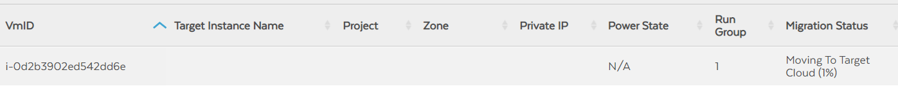

This documentation assumes that you already have a VPN connection set up
between your AWS and GCP environments. Ensure that you are able to ping
from an instance in GCP to an instance in AWS, and vice versa.

A virtual private gateway was used to establish the VPN used for this
tutorial. If you have used a transit gateway, some steps might be
different.

# Firewall rules 

A very important part of doing migrations is configuring the firewall
rules.

These firewall rules should be on the **gcp** side. Even though the
first firewall rule encompasses all the firewall rules beneath it, for
some reason we still need them. This may change at some later point.


The second last ip CIDR range is the AWS VPC with which you have a VPN
connection established. It would be different for you.

## AWS 

These security groups should be on AWS side


The above shown security groups are explained below

### Default:


This is the security group that velostrata importer should use. This is
set up when setting source cloud in migration manager. (Will be
explained later)

Sg-\*\*\*\*12b is the self-name. This is the name of this security
group.

### Aws-allow-ssh:


### Aws-allow-icmp:


### Aws-allow-internet:


### Aws-allow-vpn:


The following security groups should be attached to the AWS instance to
be migrated.


### Route table for AWS


10.240.0.0/24 is the GCP CIDR range. Yours might be different. Make sure
that the route from virtual private gateway to the GCP CIDR range is
propagated.

# Prepare VM's on AWS

In order to migrate a VM using Velostrata, you need to prepare the VM by
installing a driver on it. The drivers differ depending on the OS, and
the relevant download links can be found from:

<https://cloud.google.com/migrate/compute-engine/docs/4.11/resources/downloads>

This tutorial assumes that you want to migrate an Ubuntu instance, and
therefore installs the ubuntu driver on the VM.

Note: If for some reason you are unable to connect to your instance via
EC2 instance connect, just download the private key in your local
environment, and SSH from there.

In order to install the driver on Ubuntu machine, use the following
command
```
wget https://storage.googleapis.com/velostrata-release/4.11.9/migrate-for-gce-prep-4.11.9-0.deb

sudo dpkg -i migrate-for-gce-prep-4.11.9-0.deb

sudo apt-get update && sudo apt-get install -f -y
```
 

This will install the required driver on the machine that needs to be
migrated.

# Migrate for Compute Engine in GCP

If you have configured the VPN correctly, you will see 'migrate for
compute engine' option in your compute engine screen.


Click on it. You will need to enable the VM migration API. Once the API
is enabled, it will prompt you to create credentials. There is no need
to do that now, so go back to the compute engine page, and click on
migrate for compute engine again.

When you are there, click on switch to v4.x . At the moment of writing
this document, the newest version does not have enough documentation,
and does not work for the purpose of migration from AWS to GCP.

Click on 'Enable the required API's'.

And then 'Deploy Migration Manager'


We have already established a VPN connection, and have configured the
firewall rules. Therefore, check the "Yes, I have completed the network
connectivity prerequisites", and continue.

Enter the required information.
| <!-- -->    | <!-- -->    |
|-------------|-------------|
|**Migration manager VM instance name**|Enter a name of your choice|
|**Manager image version**|4.11.9|
|**Region**|Could be any, but it’s better to have it in the same region that your VPC subnet is in.|
|**Zone**|Select any|


  

\
 **Networking**
| <!-- -->    | <!-- -->    |
|-------------|-------------|
|**Network**|Use the network that has the VPN connection to AWS|
|**Subnet**|Use the subnet that has the VPN connection to AWS|
|**Network tags**|optional|


\
**Service accounts**

For service account for migration manager, click on the drop-down menu,
and select Create service account.

Enter the required information


\
Do the same for service account for cloud extensions


\
Write a secure password for your "migration manager 'api user' user
password" and "private key password"


\
Click continue. Review your information and click create. This will take
a few minutes to create, since it is a relatively big VM.


# Preparing AWS credentials

We need to set up a user in AWS in order to have access from the
migration manager.

Search for IAM in AWS console and click on Users from the left-hand
plane.

Click Add Users

Type a useful name and select the "Programmatic Access" credential type.


For the purposes of this tutorial, we will attach an administrator
access policy to this user. However, for production work loads, this is
not recommended. The correct way of assigning user permissions can be
found from the following link.

https://cloud.google.com/migrate/compute-engine/docs/4.8/how-to/migrate-aws-to-gcp/aws-prerequisites#creating_the_iam_group


\
Attach an AdministratorAccess policy to this user and proceed forward.

There is no need to use tags for now, so proceed forward. Review the
details, and click create user


Download the CSV file by clicking on the "download .csv" button. You
will need this information in the next step.

# Setting up Migration Manager:

To access the migration manager, go to the compute engine page, and copy
the external IP of the instance.


Open a new browser tab, paste this ip address there, and press enter.

You might see a warning that says that the connection is not private.
Migration manager uses a self-signed certificate, therefore, to proceed
further, click on advanced, and click on "proceed to" the relevant ip.


Use the following credentials
| <!-- -->    | <!-- -->    |
|-------------|-------------|
|**Username**|apiuser|
|**Password**|the password you set up when configuring the migration manager in the previous steps|


If you have forgotten your password, go to the details of migration
manager VM on the compute engine page. At the very bottom of the
details, you should be able to find the password you had set.

Click yes for both stack driver logging and metrics and proceed forward.


## Setting up source cloud:

We will now set up the source cloud. For that, click on Source Cloud

Click on cloud credentials tab, and click create.

Enter the following information


| <!-- -->    | <!-- -->    |
|-------------|-------------|
|**Credential Name**|Could be any|
|**Region**|Make sure you enter the region in which your VPC is located. This is the VPC that has a VPN connection to GCP|
|**Access Key**|You downloaded a csv file in the previous step. It contains the Access Key|
|**Secret Key**|You downloaded a csv file in the previous step. It contains the Secret Key|


Click ok.

Now click on 'Cloud details' tab and click create. Use the following
info


Again, for region, use the region in which your infrastructure is
deployed. If you have set up the credentials correctly in the previous
step, then after selecting the region, you will see your VPC id in the
VPC drop down.

For security group, use the "default" security group that was created
when setting up the firewalls. In the above screenshot the name is
"aws-gcp-security-group". This is the same as default security group. It
has the same inbound and outbound rules as the default security group.

Note: It was mentioned before during AWS security group creation that
this is the security group that will be used by velostrata importer.
This is where you are specifying it.

For the rest of the dropdowns, just select whatever you get as an
option. The options will differ in your case depending on your VPC
subnet range.


Click on OK.

The status will change to Creating.

After some time, the status would be completed to Ready.


## Setting up Target Cloud

We will now setup the target cloud.

Click on Home.

Click on target cloud.

Click on create.

Use the following information
| <!-- -->    | <!-- -->    |
|-------------|-------------|
|**Project**|your GCP project|
|**Region**|The region in which your infra is deployed|
|**VPC**|If you select the correct region, all the available VPC’s in that region would be displayed here. Select the one which has a VPN connection to AWS|
|**Default destination project for workloads**|your GCP project|


For default service account for workloads, use the service account you
created for cloud extensions during the setup of migration manager.


Click on Cloud extensions, and use the following information
| <!-- -->    | <!-- -->    |
|-------------|-------------|
|**Cloud extension name**|Could be any|
|**Service account for edge nodes**|use the service account you created for cloud extensions during the setup of migration manager|
|**Cloud extension size**|Small|


Click on Zones, and enter the following information


You might have different zones and subnets available, so decide
according to the options you have.

Finally, click on OK.

The state of the cloud extension would go to "creating". Wait for some
time until it says "Active". It will take 4-5 min for this. You should
get something like the following


## Migration waves

Now since the source and target clouds are set up, we can move forward.

Click on Home, and then click on Migration waves.

Click generate runbook, and use the following information
| <!-- -->    | <!-- -->    |
|-------------|-------------|
|**Name**|Name|
|**Value**|*|
|**Target cloud extension**|the one you just created in the previous step|


Click create

This will download a csv file to your local machine.

Open sheets.google.com in a new window and click blank. Then,
fileimportupload and select the file you just downloaded.

Use the separator type as 'Comma', and leave the other settings to
default.

Click import data.

This should import the list of VM's you have in your AWS environment. If
you only had 1 vm, you would only see 1 entry in this file.

For the VM that you want to migrate, change the 'RunGroup' column from
-1 to 1. Then scroll to the right, and for 'target instance type', write
n1-standard-1.

Click on file→download→comma separate values (.csv)

This will download the file to your local machine


Go back to the migration manager tab, and click on new wave. Give it a
relevant name, and use the file that you just downloaded. Make sure to
use the edited file that you just downloaded.


Click save

Now click on the name. This will highlight the entire row. Click on
action and click on validate.


Say Yes to run validation prompt.

When the validation status says "Passed", click on the wave again to
select it. Then Action→New job

For operation, use Full migration, and click start.


Click on the monitor icon




You can refresh the page to get updated status of migration. However,
the migration will take some time.

You can go to AWS console and see that the VM to be migrated has been
stopped. On the GCP side, you will notice on the compute engine page
that 2 velostrata edge node instances are running.


When the migration status says Ready to Detach, it means that your VM
has been migrated.


You will see a new instance running in the Compute engine page. You can
then assign it a public IP if you want to access it from the internet.


